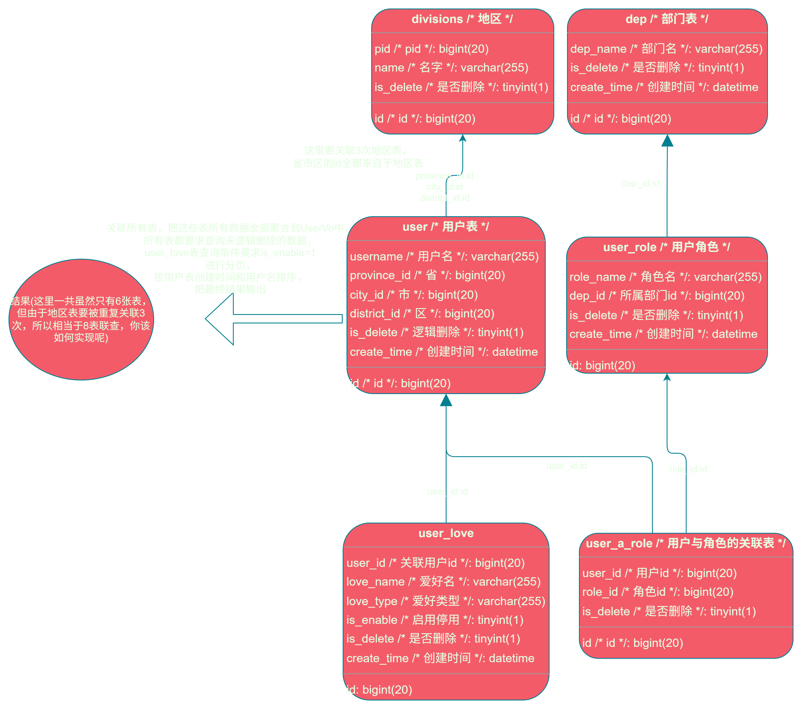

# 由cyp制作的用于简化复杂查询的工具 (A tool for simplifying complex queries, which is made by cyp)
# mybatis-plus-cy
A tool for simplifying query operations, which is made by cyp.
## Dependency
``` xml
    <dependencies>
        <!-- mybatis-plus-cy-spring-boot-starter 就是核心依赖，依赖版本和mybatis-plus保持一致 -->
        <dependency>
            <groupId>io.github.caoyipeng1</groupId>
            <artifactId>mybatis-plus-cy-spring-boot-starter</artifactId>
            <version>3.5.9</version>
        </dependency>
        <dependency>
            <groupId>com.baomidou</groupId>
            <artifactId>mybatis-plus-spring-boot3-starter</artifactId>
            <version>3.5.9</version>
        </dependency>
        <dependency>
            <groupId>com.mysql</groupId>
            <artifactId>mysql-connector-j</artifactId>
            <version>9.1.0</version>
        </dependency>
        <dependency>
            <groupId>org.springframework.boot</groupId>
            <artifactId>spring-boot-starter-logging</artifactId>
            <version>3.4.4</version>
        </dependency>
        <dependency>
            <groupId>org.springframework.boot</groupId>
            <artifactId>spring-boot-starter-web</artifactId>
            <version>3.4.4</version>
        </dependency>
    </dependencies>
```
## Example
### 快速开始 example1
* service
```java
@Service
public class TestUserServiceImpl extends ServiceImpl<TestUserMapper, TestUser> implements TestUserService {
    /**
     * TestUser表 与 TestUserAttribute表 的一对多联合查询
     */
    public List<Map<String, Object>> iGetO2M(){
        // 单表查询 TestUser表
        List<TestUser> testUserList = list();
        /*
        * 将单表查询结果testUserList被new JdbcArrayList<>()包裹，并调用o2m一对多方法;
        * o2m方法的 第一个参数是TestUser的表的关联字段Id，第二个参数是TestUserAttribute表的关联字段testUserId
        * 应为这里没有传入手动结果映射参数，所以会自动结果映射，映射结果为List<Map<String, Object>>,这个就是一对多的查询结果，不需要你再专门去为他编写Vo等来包装一对多结果；
        * */
        List<Map<String, Object>> rs1 = new JdbcArrayList<>(testUserList).o2m(TestUser::getId, TestUserAttribute::getTestUserId);
        return rs1;
    }
}
```

* entity
```java
/**
 * mybatis-plus-cy 框架已适配mybatis-plus注解，仍然你可以继续使用mybatis-plus的这些注解来实现 表 与 对象 的映射关系
 */
@TableName("test_user")
public class TestUser {
    @TableId
    private Long id;
    @TableField("user_name")
    private String userName;
    @TableField("create_time")
    private LocalDateTime createTime;
    public Long getId() {
        return id;
    }
    public void setId(Long id) {
        this.id = id;
    }
    public String getUserName() {
        return userName;
    }
 ```
```java
@TableName("test_user_attribute")
public class TestUserAttribute {
    @TableId
    private Long id;
    @TableField("test_user_id")
    private Long testUserId;
    @TableField("attribute_name")
    private String attributeName;
    public Long getId() {
        return id;
    }
    public Long getTestUserId() {
        return testUserId;
    }
    public String getAttributeName() {
        return attributeName;
    }
}
```
* mapper
```java
@Mapper
public interface TestUserAttributeMapper extends BaseMapper<TestUserAttribute> {
}
```
```java
@Mapper
public interface TestUserMapper extends BaseMapper<TestUser> {
}

```
* sql
```sql
insert into test_user (id, user_name, create_time)
values  (1, '张三', '2025-05-24 20:37:29'),
        (2, '李四', '2025-02-24 20:38:31'),
        (3, '王五', '2025-05-16 10:39:21');
```
```sql
insert into test_user_attribute (id, test_user_id, attribute_name)
values  (1, 1, '喜欢唱歌'),
        (2, 1, '性别男'),
        (3, 2, '喜欢游泳'),
        (4, 2, '性别女'),
        (5, 3, '喜欢画画'),
        (6, 3, '喜欢乒乓球'),
        (7, 3, '性别男');
```
### example2
* 需求（复杂联查的需求）
  
* 表数据

user表

| id | username | province\_id | city\_id | district\_id | is\_delete | create\_time |
| :--- | :--- | :--- | :--- | :--- | :--- | :--- |
| 1 | 小雨 | 1 | 2 | 3 | 0 | 2025-02-06 01:01:01 |
| 2 | 小猪 | 1 | 2 | 4 | 0 | 2025-02-06 01:01:01 |
| 3 | 小牛 | 1 | 2 | 5 | 0 | 2025-02-06 01:01:01 |
| 4 | 小马 | 1 | 2 | 3 | 0 | 2025-02-06 01:01:01 |
| 5 | 小笨 | 1 | 6 | 7 | 0 | 2025-02-06 01:01:01 |
| 6 | 小东 | 1 | 8 | 9 | 0 | 2025-02-06 01:01:01 |
| 7 | 小爱 | 10 | 11 | 12 | 0 | 2025-02-06 01:01:01 |
| 8 | 小鹏 | 1 | 2 | 3 | 0 | 2025-02-06 01:01:01 |

divisions表

| id | pid | name | is\_delete |
| :--- | :--- | :--- | :--- |
| 1 | -1 | 四川省 | 0 |
| 2 | 1 | 成都市 | 0 |
| 3 | 2 | 高新区 | 0 |
| 4 | 2 | 天府新区 | 0 |
| 5 | 2 | 青羊区 | 0 |
| 6 | 1 | 绵阳市 | 0 |
| 7 | 6 | 游仙区 | 0 |
| 8 | 1 | 德阳市 | 0 |
| 9 | 8 | 罗江区 | 0 |
| 10 | -1 | 湖北省 | 0 |
| 11 | 10 | 武汉市 | 0 |
| 12 | 11 | 江岸区 | 0 |


user_a_love关联中间表

| id | user\_id | role\_id | is\_delete |
| :--- | :--- | :--- | :--- |
| 1 | 1 | 3 | 0 |
| 2 | 1 | 2 | 0 |
| 3 | 2 | 3 | 0 |
| 4 | 2 | 4 | 0 |
| 5 | 3 | 1 | 0 |
| 6 | 4 | 4 | 0 |
| 7 | 5 | 4 | 0 |
| 8 | 5 | 2 | 0 |
| 9 | 7 | 2 | 0 |
| 10 | 7 | 3 | 0 |
| 11 | 7 | 4 | 0 |
| 12 | 8 | 6 | 0 |
| 13 | 8 | 5 | 0 |

user_love表

| id | user\_id | love\_name | love\_type | is\_enable | is\_delete | create\_time |
  | :--- | :--- | :--- | :--- | :--- | :--- | :--- |
| 1 | 1 | 爱打羽毛球 | 体育 | 0 | 0 | 2025-01-02 02:06:13 |
| 2 | 2 | 爱打羽毛球 | 体育 | 1 | 0 | 2025-01-02 02:06:13 |
| 3 | 6 | 爱打羽毛球 | 体育 | 1 | 0 | 2025-01-02 02:06:13 |
| 4 | 7 | 爱打羽毛球 | 体育 | 1 | 0 | 2025-01-02 02:06:13 |
| 5 | 8 | 爱打乒乓球 | 体育 | 1 | 0 | 2025-01-02 02:06:13 |
| 6 | 2 | 爱打乒乓球 | 体育 | 1 | 0 | 2025-01-02 02:06:13 |
| 7 | 6 | 爱打乒乓球 | 体育 | 1 | 0 | 2025-01-02 02:06:13 |
| 8 | 1 | 爱踢足球 | 体育 | 1 | 0 | 2025-01-02 02:06:13 |
| 9 | 8 | 爱打游戏 | 娱乐 | 1 | 0 | 2025-01-02 02:06:13 |
| 10 | 1 | 爱打游戏 | 娱乐 | 1 | 0 | 2025-01-02 02:06:13 |
| 11 | 3 | 爱打游戏 | 娱乐 | 1 | 0 | 2025-01-02 02:06:13 |
| 12 | 5 | 爱打游戏 | 娱乐 | 1 | 0 | 2025-01-02 02:06:13 |
| 13 | 7 | 爱刷视频 | 娱乐 | 1 | 0 | 2025-01-02 02:06:13 |
| 14 | 4 | 爱刷视频 | 娱乐 | 1 | 0 | 2025-01-02 02:06:13 |

user_role表

| id | role\_name | dep\_id | is\_delete | create\_time |
| :--- | :--- | :--- | :--- | :--- |
| 1 | hr | 1 | 0 | 2025-01-01 00:01:00 |
| 2 | 产品经理 | 2 | 0 | 2025-01-01 00:02:01 |
| 3 | 售前 | 2 | 0 | 2025-01-01 01:00:00 |
| 4 | 后端工程师 | 2 | 0 | 2025-01-01 02:01:00 |
| 5 | 工程监理 | 3 | 0 | 2025-01-01 03:03:00 |
| 6 | 水利设计师 | 3 | 0 | 2025-01-01 04:00:00 |

dep表

| id | dep\_name | is\_delete | create\_time |
| :--- | :--- | :--- | :--- |
| 1 | 人力资源部 | 0 | 2025-01-01 00:00:04 |
| 2 | 软件工程部 | 0 | 2025-01-01 02:00:01 |
| 3 | 水利工程部 | 0 | 2025-01-01 03:02:00 |

实现：上述复杂查询需求要聚合这六张表的数据，由下面UserService这个业务类中的业务方法中的一行业务代码即可实现

```java
public Page<Map<String, Object>> page(PageParamDto<User> pageParamDto) {
    //保证mybatis-plus-cy-spring-boot-starter依赖版本大于等于3.5.9.4
        return pageParamDto.validateSortFields(User::getCreateTime,User::getUsername).executeByTypePage(this::page)
                .m2o(User::getProvinceId, Divisions::getId).m2oFree(User::getCityId,Divisions::getId).m2oFree(User::getDistrictId, Divisions::getId)
                .o2mFree(User::getId,UserLove::getUserId,Wp.<UserLove>lqw().eq(UserLove::getIsEnable,true))
                .m2mEzFree(User::getId, UserARole::getUserId, UserARole::getRoleId, UserRole::getId,e->e.m2o(UserRole::getDepId,Dep::getId))
                .getPage();
    }
```
进行业务代码功能测试

```java
@Autowired
private UserService userService;
@Test
public void test01() {
  //设置 pageName为2，pageSize为3;
  PageParamDto<User> pageParamDto = new PageParamDto<>(2,3);
  //传入排序字段，先按createTime降序排列，再按username升序排列
  pageParamDto.setSortFieldList(List.of("-createTime","+username"));
  //传入构造好的条件，执行业务流程代码
  Page<Map<String, Object>> mapPage = userService.page(pageParamDto);
  //打印结果
  System.out.println(mapPage);
}
```
## Usage
尽情期待......